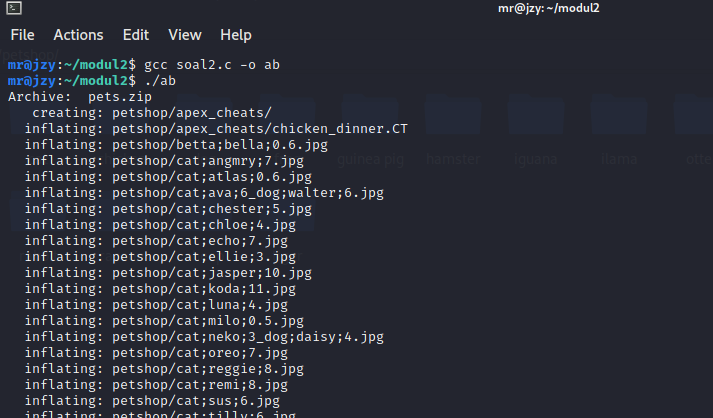
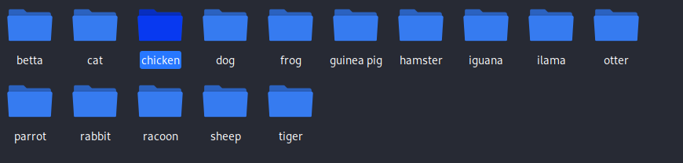
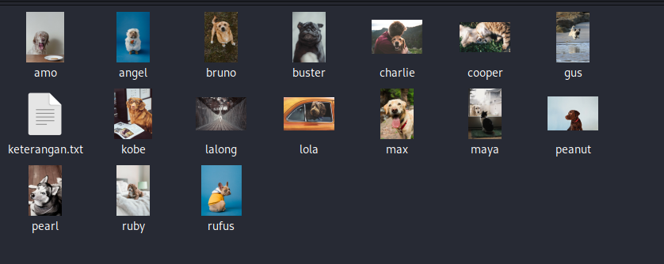
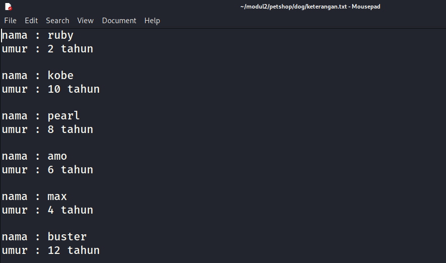

# soal-shift-sisop-modul-2-IT01-2021
### Nama Anggota Kelompok:
1. Widya Inayatul Luthfiyah (05311940000010)
2. Muhammad Rizqi Wijaya (05311940000014)
3. Gavin Bagus Kanzie N (05311940000028)
---
## Soal Nomor 1
Pada suatu masa, hiduplah seorang Steven yang hidupnya pas-pasan. Steven punya pacar, namun sudah putus sebelum pacaran. Ketika dia galau memikirkan mantan, ia selalu menonton https://www.youtube.com/watch?v=568DH_9CMKI untuk menghilangkan kesedihannya. Di lain hal Steven anak yang tidak amat sangat super membenci matkul sisop, beberapa jam setelah diputus oleh pacarnya dia menemukan wanita lain bernama Stevany, namun Stevany berkebalikan dengan Steven karena menyukai sisop. Steven ingin terlihat jago matkul sisop demi menarik perhatian Stevany. Pada hari ulang tahun Stevany, Steven ingin memberikan Stevany zip berisikan hal-hal yang disukai Stevany. Steven ingin isi zipnya menjadi rapi dengan membuat folder masing-masing sesuai extensi. 
### Penyelesaian :
- Nama folder-foldernya adalah Musyik untuk mp3, Fylm untuk mp4, dan Pyoto untuk jpg 
- Untuk musik, film, dan foto download di link yang disediakan 
- meng-extract zip setelah didownload
- Memindahkannya ke dalam folder yang telah dibuat (hanya file yang dimasukkan).
- Berjalan otomatis 6 jam sebelum waktu ulang tahun Stevany. 
- Setelah itu pada waktu ulang tahunnya Stevany 09 April Pukul 22.22 WIB, semua folder di zip dengan nama Lopyu_Stevany.zip dan semua folder akan di delete(sehingga hanya menyisakan .zip).

Catatan :
- Cukup jalankan script 1x serta ubah time dan date 
- Tidak boleh menggunakan fungsi system(), mkdir(), dan rename() dan cron


```
#include <sys/types.h>
#include <sys/stat.h>
#include <stdio.h>
#include <stdlib.h>
#include <fcntl.h>
#include <errno.h>
#include <unistd.h>
#include <syslog.h>
#include <string.h>
#include <time.h>
#include <wait.h>

int main(int argc, char * argv[]) {
  pid_t process_id = 0;
  pid_t sid = 0;
  // buat child process
  process_id = fork();
  // indikasi fork() gagal
  if (process_id < 0) {
    printf("fork gagal!\n");
    // Return exit status
    exit(1);
  }
  // PARENT PROCESS. harus dibunuh.
  if (process_id > 0) {
    // return success exit status
    exit(0);
  }

  //unmask file mode
  umask(0);
  //set new session
  sid = setsid();
  if (sid < 0) {
    // return gagal
    exit(1);
  }

  // ganti current working directory
  chdir("/home/pepega/sisopShift2/soal1/");

  // close stdin. stdout dan stderr
  close(STDIN_FILENO);
  close(STDOUT_FILENO);
  close(STDERR_FILENO);
  // main loop
  while (1) {
    // tidur dulu
    sleep(1);
    int status;
    time_t rawtime;
    struct tm * timeinfo;
    char time_now[26];

    //dapatkan waktu sekarang
    time( & rawtime);
    timeinfo = localtime( & rawtime);
    strftime(time_now, 26, "%F_%H_%M_%S", timeinfo);

    // jika 6 jam sebelum hbd
    if (strcmp(time_now, "2021-04-09_16_22_00") == 0) {
      pid_t child_id;
      int status;

      child_id = fork();

      if (child_id < 0) {
        exit(EXIT_FAILURE); // Jika gagal membuat proses baru, program akan berhenti
      }

      if (child_id == 0) {
        // child
        char * argv[] = {
          "mkdir",
          "-p",
          "Musyik",
          "Fylm",
          "Pyoto",
          NULL
        };
        execv("/bin/mkdir", argv);

      } else {
        while ((wait( & status)) > 0);
        int n1 = fork();
        int n2 = fork();

        if (n1 > 0 && n2 > 0) {
          //Download foto dari google drive
          execlp("/usr/bin/wget", "wget", "--user-agent=\"Mozilla\"", "--no-check-certificate", "-b", "-q",
            "https://drive.google.com/u/0/uc?id=1FsrAzb9B5ixooGUs0dGiBr-rC7TS9wTD&export=download",
            "-O Foto_for_Stevany.zip", NULL);;
        } else if (n1 == 0 && n2 > 0) {
          //Download Musik dari google drive
          execlp("/usr/bin/wget", "wget", "--user-agent=\"Mozilla\"", "--no-check-certificate", "-b", "-q",
            "https://drive.google.com/u/0/uc?id=1ZG8nRBRPquhYXq_sISdsVcXx5VdEgi-J&export=download",
            "-O Musik_for_Stevany.zip", NULL);
        } else if (n1 > 0 && n2 == 0) {
          //Download Film dari google drive
          execlp("/usr/bin/wget", "wget", "--user-agent=\"Mozilla\"", "--no-check-certificate", "-b", "-q",
            "https://drive.google.com/u/0/uc?id=1ktjGgDkL0nNpY-vT7rT7O6ZI47Ke9xcp&export=download",
            "-O Film_for_Stevany.zip", NULL);
        } else {
          sleep(12); // tunggu file selesai didownload. 12 detik biar aman untuk internet lemot
          int n3 = fork();
          int n4 = fork();
          if (n3 > 0 && n4 > 0) {
           // unzip
           execlp("/usr/bin/unzip", "unzip", "*.zip", NULL);
          }
          //pindah ke folder musyik, fylm, pyoto
          else if (n3 == 0 && n4 > 0) {
      sleep(5);
         char * delete[] = {
              "rm", "-rf",
              "Pyoto",
              "Fylm",
              "Musyik",
              NULL
            };
            execv("/bin/rm", delete);
             
          } 
          else if (n3 > 0 && n4 == 0) {
      sleep(7);
            char * movefilm[] = {
              "mv", "-v",
              "FILM",
              "Fylm",
              NULL
            };
            execv("/bin/mv", movefilm);
          } else {
            int n7 = fork();
            int n8 = fork();
            int status;

            if (n7 > 0 && n8 > 0) {
              sleep(7);
              char * movemusik[] = {
                "mv", "-v",
                "MUSIK",
                "Musyik",
                NULL
              };
              execv("/bin/mv", movemusik);

            } else if (n7 == 0 && n8 > 0) {
              sleep(7);
              char * movefoto[] = {
                "mv", "-v",
                "FOTO",
                "Pyoto",
                NULL
              };
              execv("/bin/mv", movefoto);
            } else if (n7 > 0 && n8 == 0) {
              // loop sampai HBD jam 22:22
              while (1) {
                time_t rawtime;
                struct tm * timeinfo;
                char time_now[26];

                //dapatkan waktu sekarang
                time( & rawtime);
                timeinfo = localtime( & rawtime);
                strftime(time_now, 26, "%F_%H_%M_%S", timeinfo);
                if (strcmp(time_now, "2021-04-09_22_22_00") == 0) break;
              }
              while ((wait( & status)) > 0);
              int n5 = fork();
              int n6 = fork();
              if (n5 > 0 && n6 > 0) {
                // zip semua
                char * zipAll[] = {
                  "zip",
                  "-r",
                  "Lopyu_Stevany.zip",
                  "Pyoto",
                  "Fylm",
                  "Musyik",
                  NULL
                };
                execv("/usr/bin/zip", zipAll);
              } else if (n5 == 0 && n6 > 0) {
                // tunggu zip selesai dulu baru hapus folder
                sleep(2);
                char * deleteAll[] = {
                  "rm",
                  "-rf",
                  "Pyoto",
                  "Fylm",
                  "Musyik",
                  NULL
                };
                execv("/bin/rm", deleteAll);
              } else if (n5 > 0 && n6 == 0) {
                // hapus .zip sisanya
                char * deleteAll2[] = {
                  "rm",
                  " Foto_for_Stevany.zip",
                  " Musik_for_Stevany.zip",
                  " Film_for_Stevany.zip",
                  NULL
                };
                execv("/bin/rm", deleteAll2);
              }

            }

          }

        }
      }
    }
  }
  return (0);
}
```

### Penjelasan Program
#### Library
Berikut adalah library yang digunakan untuk menyelesaikan soal ini:

```#include <sys/types.h>``` = untuk tipe data pid_t

```#include <sys/stat.h>``` = untuk mengembalikan status waktu

```#include <stdio.h>``` = untuk standard input-output

```#include <stdlib.h>``` = untuk fungsi umum

```#include <fcntl.h>``` = untuk proses id dalam proses kunci (```pid_t()```)

```#include <errno.h>``` = untuk memberikan tambahan error pada sistem

```#include <unistd.h>``` = untuk melakukan system call ```fork()```

```#include <sysloq.h>``` = untuk mengirim pesan ke system logger

```#include <string.h>``` = untuk melakukan manipulasi string, misalnya ```strcmp()```

```#include <time.h>``` = untuk manipulasi date and time

```#include <wait.h>``` = untuk melakukan fungsi ```wait ()```

#### Fungsi main
Pada fungsi main, program kami menerima 2 argumen. argumen ini nantinya digunakan untuk menentukan bash program mana yang akan dibuat:
```
int main(int argc, char *argv[])
{
  // isi fungsi
}
````

#### Daemon Process
Melakukan ```fork()``` pada parent process lalu membunuhnya agar sistem mengira proses tersebut selesai.
```
    pid_t process_id = 0;
    pid_t sid = 0;
    // buat child process
    process_id = fork();
    // indikasi fork() gagal
    if (process_id < 0)
    {
        printf("fork failed!\n");
        // Return in exit status
        exit(1);
    }
    // PARENT PROCESS. harus dibunuh.
    if (process_id > 0)
    {
        // return success exit status
        exit(0);
    }
```
Kemudian mengatur umask agar mendapatkan full akses terhadap file
``` umask (0);```

Mengatur SID agar child process tidak menjadi orphan 
```
    if (sid < 0)
    {
        // return gagal
        exit(1);
    }
```

Setelah itu mengubah working directory. Directory berbeda tergantung tiap komputer, jadi menyesuaikan 
```
chdir("/home/pepega/sisopShift2/soal1/");
```

Menutup file descriptor standar karena daemon tidak boleh mengakases terminal
```
    close(STDIN_FILENO);
    close(STDOUT_FILENO);
    close(STDERR_FILENO);
```

Terakhir, program utama akan berada di while loop
```
    while (1)
    {
      // program utama
    }
```
## No 1a
Untuk soal ini, membuat 3 folder dengan nama Musyik, Fylm, dan Pyoto menggunakan fork dan exec
```
child_id = fork();

      if (child_id < 0) {
        exit(EXIT_FAILURE); // Jika gagal membuat proses baru, program akan berhenti
      }
      if (child_id == 0) {
        // child
 char * argv[] = {
          "mkdir",
          "-p",
          "Musyik",
          "Fylm",
          "Pyoto",
          NULL
        };
        execv("/bin/mkdir", argv);
```
## No 1b
Untuk sub soal ini, program akan mendownload file foto, video, dan film dari link yang telah disediakan
```
 } else {
        while ((wait( & status)) > 0);
        int n1 = fork();
        int n2 = fork();

        if (n1 > 0 && n2 > 0) {
          //Download foto dari google drive
          execlp("/usr/bin/wget", "wget", "--user-agent=\"Mozilla\"", "--no-check-certificate", "-b", "-q",
            "https://drive.google.com/u/0/uc?id=1FsrAzb9B5ixooGUs0dGiBr-rC7TS9wTD&export=download",
            "-O Foto_for_Stevany.zip", NULL);;
        } else if (n1 == 0 && n2 > 0) {
          //Download Musik dari google drive
          execlp("/usr/bin/wget", "wget", "--user-agent=\"Mozilla\"", "--no-check-certificate", "-b", "-q",
            "https://drive.google.com/u/0/uc?id=1ZG8nRBRPquhYXq_sISdsVcXx5VdEgi-J&export=download",
            "-O Musik_for_Stevany.zip", NULL);
        } else if (n1 > 0 && n2 == 0) {
          //Download Film dari google drive
          execlp("/usr/bin/wget", "wget", "--user-agent=\"Mozilla\"", "--no-check-certificate", "-b", "-q",
            "https://drive.google.com/u/0/uc?id=1ktjGgDkL0nNpY-vT7rT7O6ZI47Ke9xcp&export=download",
            "-O Film_for_Stevany.zip", NULL);
        } else {
          sleep(12); // tunggu file selesai didownload. 12 detik biar aman untuk internet lemot
```
Dilakukan perulangan dan penggunaan ```wget``` command untuk bisa mengunduh file. Lalu dilakukan ```sleep(12)``` dan penamaan filenya sudah disesuaikan dengan file yang didownload

## No 1c
Untuk sub soal ini, program harus mengextract file yang telah didownload. Disini kami menggunakan ```fork()```dan ```execlp``` unzip untuk mengextract file
```
 int n3 = fork();
          int n4 = fork();
          if (n3 > 0 && n4 > 0) {
           // unzip
           execlp("/usr/bin/unzip", "unzip", "*.zip", NULL);
          }
```

## No 1d
Untuk sub soal ini, program harus memindahkan file dari file yang telah diextract ke dalam file yang telah dibuat.
```
 char * movefilm[] = {
              "mv", "-v",
              "FILM",
              "Fylm",
              NULL
            };
            execv("/bin/mv", movefilm);
          } else {
            int n7 = fork();
            int n8 = fork();
            int status;

            if (n7 > 0 && n8 > 0) {
              sleep(7);
              char * movemusik[] = {
                "mv", "-v",
                "MUSIK",
                "Musyik",
                NULL
              };
              execv("/bin/mv", movemusik);

            } else if (n7 == 0 && n8 > 0) {
              sleep(7);
              char * movefoto[] = {
                "mv", "-v",
                "FOTO",
                "Pyoto",
                NULL
              };
              execv("/bin/mv", movefoto);
```
## No. 1e
Untuk sub soal ini, program harus berjalan otomatis 6 jam sebelum waktu ulang tahun stevany 
```
 if (strcmp(time_now, "2021-04-09_16_22_00") == 0) {
      pid_t child_id;
      int status;
```
## No. 1f
Untuk sub soal terakhir ini, folder akan di zip dengan nama Lopyu_Stevany.zip dan menghapus semua folder yang telah dibuat hingga hanya menyisakan folder zip dari hasil mendownload file dari link yang telah disediakan.
```
 char * zipAll[] = {
                  "zip",
                  "-r",
                  "Lopyu_Stevany.zip",
                  "Pyoto",
                  "Fylm",
                  "Musyik",
                  NULL
                };
                execv("/usr/bin/zip", zipAll);
              } else if (n5 == 0 && n6 > 0) {
                // tunggu zip selesai dulu baru hapus folder
                sleep(2);
                char * deleteAll[] = {
                  "rm",
                  "-rf",
                  "Pyoto",
                  "Fylm",
                  "Musyik",
                  NULL
                };
                execv("/bin/rm", deleteAll);
              } else if (n5 > 0 && n6 == 0) {
                // hapus .zip sisanya
                char * deleteAll2[] = {
                  "rm",
                  " Foto_for_Stevany.zip",
                  " Musik_for_Stevany.zip",
                  " Film_for_Stevany.zip",
                  NULL
                };
                execv("/bin/rm", deleteAll2);
              }

            }

          }
```
Untuk ```zip``` menggunakan option ```-r``` untuk dapat melakukan zip directory beserta semua isi di dalamnya. Lalu untuk menghapus folder dengan perintah ```rm```

---
## Soal Nomor 2
Loba bekerja di sebuah petshop terkenal, suatu saat dia mendapatkan zip yang berisi banyak sekali foto peliharaan dan Ia diperintahkan untuk mengkategorikan foto-foto peliharaan tersebut. Loba merasa kesusahan melakukan pekerjaanya secara manual, apalagi ada kemungkinan ia akan diperintahkan untuk melakukan hal yang sama. Kamu adalah teman baik Loba dan Ia meminta bantuanmu untuk membantu pekerjaannya.

## Source Code
Source code dapat dilihat di sini [soal2.c](https://github.com/rizwijaya/soal-shift-sisop-modul-2-IT01-2021/blob/main/soal2/soal2.c)

## Cara Pengerjaan
### Analisis Soal
Secara keseluruhan, hal yang harus dilakukan dalam soal tersebut adalah:
1.  Mengextract zip yang diberikan ke dalam folder “/home/[user]/modul2/petshop”. Program harus bisa membedakan file dan folder dikerjakan dan menghapus folder-folder yang tidak dibutuhkan.
2. Membuatkan folder-folder yang dibutuhkan sesuai dengan isi zip. (kucing : “/petshop/cat”)
3. Setelah folder kategori berhasil dibuat, Memindahkan foto ke folder dengan kategori yang sesuai dan di rename dengan nama peliharaan.
4. Maka foto harus di pindah ke masing-masing kategori yang sesuai. Contoh: foto dengan nama “dog;baro;1_cat;joni;2.jpg” dipindah ke folder “/petshop/cat/joni.jpg”
5. Di setiap folder buatlah sebuah file "keterangan.txt". Format dibuat sesuai contoh. 

Catatan :
- Setiap data peliharaan disimpan sebagai nama foto dengan format [jenis peliharaan]:[nama peliharaan]:[umur peliharaan dalam tahun]. Jika terdapat lebih dari satu peliharaan, data dipisahkan menggunakan underscore(_).
- Tidak boleh menggunakan fungsi system(), mkdir(), dan rename().
- Menggunakan fork dan exec.

### Penjelasan Program
#### Library
Berikut adalah library yang digunakan untuk menyelesaikan soal ini:

```#include <stdlib.h>```= untuk fungsi-fungsi general

```#include <sys/types.h>``` = untuk tipe data pid_t

```#include <unistd.h>``` = untuk melakukan system call ```fork()```

```#include <wait.h>``` = untuk melakukan fungsi ```wait ()```

```#include <dirent.h>``` = untuk membaca atau membuka directory

```#include <string.h>``` = untuk melakukan manipulasi string, misalnya ```strcmp()```

```#include <stdio.h>``` = untuk standard input-output

#### Program Utama
Pada fungsi main ini berisi cara mengekstrack file .zip dan bagaimana memisahkan setiap string yang terdapat ```;``` dan ```_``` kebeberapa bagian.
```
child2 = fork();
if (child2 == 0){
    char *unzip[] = {"unzip", "pets.zip", "-d",
                    "petshop", NULL};
    execv("/usr/bin/unzip", unzip);
}
while(wait(NULL) != child2);

sleep(5);
```
Dalam program diatas merupakan program untuk melakukan ekstrak file ```pets.zip``` kedalam directory petshop dengan menggunakan argument ```unzip``` yang kemudian dieksekusi menggunakan ```execv()```.
```
if (directory) {
        while ((en = readdir(directory)) != NULL) {
          .......
          .......
          .......
        }
        closedir(directory);
}
```
Setelah melakukan ekstrak file ```.zip``` tersebut selanjutnya membuka folder ```petshop``` dengan menggunakan fungsi ```opendir``` dan ```readdir```. Dimana dalam membuka folder tersebut, pertama-tama melakukan pengecekan dengan menggunakan logika percabangan apakah folder dapat dibuka jika iya maka akan berlanjutnya dengan membaca file atau folder yang terdapat di directory ```petshop``` dengan menggunakan perulangan ```while``` dan apabila sudah selesai atau kondisi while sudah tidak terpenuhi maka akan menutup directory tersebut menggunakan ```closedir(directory)```.
```
directory = opendir("petshop");
    if (directory) {
        while ((en = readdir(directory)) != NULL) {    //Loop semua file yang terdapat di petshop
            
            int baris = 1;
            int ext = strlen(en->d_name)-4;
            sprintf(namafile, "%s", en->d_name); //Dapatkan nama file
            .....
            .....
            .....
    }
```
Kemudian dalam perulangan while melakukan inisialisasi nilai awal dari variabel ```baris = 1``` dan inisialisasi variabel ```ext``` dengan hasil dari ```strlen(en->d_name)-4``` yang akan menghasilkan ekstension dari file tersebut. 
```
sprintf(namafile, "%s", en->d_name); //Dapatkan nama file
```
Pada baris selanjutnya menggunakan ```sprintf``` untuk menyimpan nama file yang didapatkan kedalam variabel ```namafile```.
```
if (strcmp(namafile, "apex_cheats")  == 0 || strcmp(namafile, "musics")  == 0 || strcmp(namafile, "unimportant_files")  == 0) {
    char delete[100];
    sprintf(delete, "petshop/%s", namafile);

    child3 = fork();
    if (child3 == 0) {
        char * deleteall[] = {"rm", "-rf", delete, NULL};
        execv("/bin/rm", deleteall);
    }

    while(wait(NULL) != child3);
    sleep(5);
} else if(strstr(&en->d_name[ext], ".jpg")) {   //filter format file jpg
      .....
      .....
}
```
Selanjutnya masih didalam perulangan ```while``` terdapat program untuk mengecek apakah file tersebut penting atau tidak, dimana dalam program ini menggunakan logika percabangan ```if else```.
Pada ```if``` pertama apabila ditemukan file tidak penting maka akan melakukan penghapusan file tersebut dengan menggunakan argumen ```rm -rf```
yang artinya akan menghapus folder atau file yang ditemukan secara keseluruhan.
```
if (strcmp(namafile, "apex_cheats")  == 0 || strcmp(namafile, "musics")  == 0 || strcmp(namafile, "unimportant_files")  == 0) {
    .....
    .....
} else if(strstr(&en->d_name[ext], ".jpg")) {   //filter format file jpg

    char *token = strtok(en->d_name, ";");
    while (token != NULL) { //Pisahkan nama file dengan deliminter
        if (baris == 1) {  //deliminter pertama maka simpan ke kategori
            sprintf(kategori, "%s", token);
        }else if (baris == 2) {  //deliminter kedua maka simpan ke nama
            sprintf(nama, "%s", token);
        }else if (baris == 3) {  //deliminter ketiga maka simpan ke umur
            sprintf(umur, "%s", token);
            strtok(umur, "_");
            strtok(umur, "j");
            if (umur[strlen(umur) - 1] == '.') {
                umur[strlen(umur) - 1] = '\0';
            }
        }
        token = strtok(NULL, ";");
        baris++;
    }
    createfolder(kategori);
    createfile(kategori);
    movefile(kategori, namafile, nama);
    isifile(nama, umur, kategori);
}
```
Kemudian pada pengecekan yang kedua dengan menggunakan ```else if``` akan mengecek apakah format file tersebut merupakan file ```.jpg``` yang mana apabila kondisi terpenuhi maka akan melakukan pemisahan setiap karakter yang terdapat dari nama file tersebut yang terdapat tanda ```;```. 

Dimana dalam melakukan pemecahan karakter tersebut menggunakan fungsi ```strtok``` yang terdapat pada c, kemudian dengan menggunakan logika percabangan ```if else``` akan mengecek apabila menemukan ```;``` pertama atau nilai ```baris == 1```, maka akan menyimpan baris pertama tersebut kedalam ```kategori```. Sedangkan apabila ```baris == 2``` akan menyimpan kedalam variabel ```nama``` dan apabila ```baris == 3``` maka akan menyimapan kedalam variabel ```umur```, kemudian apabila terdapat tanda ```_``` atau ```j``` maka akan melakukan split pada karakter, sedangkan apabila ditemukan ```.``` pada baris terakhir akan langsung diterminated menggunakan ```\0```.

Kemudian memanggil fungsi ```createfolder, createfile, movefile, dan isifile```.

#### Fungsi Buat Folder
Selanjutnya dalam program, terdapat fungsi buat folder dimana dalam fungsi ini akan membuat folder baru berdasarkan dengan kategori yang ditemukan.
```
void createfolder(char kategori[]) { //buat folder dengan nama kategori
    char folder[100];

    sprintf(folder, "petshop/%s", kategori);
    child2 = fork();
    if (child2 == 0){
        char *argv[] = {"mkdir", "-p", folder, NULL};
        execv("/bin/mkdir", argv);
    }
    while(wait(NULL) != child2);
}
```
Pertama menggabungkan strings ```petshop``` yang merupakan directory dengan variabel ```kategori``` menggunakan ```sprintf```. 
```
sprintf(folder, "petshop/%s", kategori);
```
Kemudian membuat proses baru dan menjalankan argument buat folder dengan menggunakan perintah ```mkdir``` yang selanjutnya dieksekusi oleh ```execv()```
```
child2 = fork();
if (child2 == 0){
    char *argv[] = {"mkdir", "-p", folder, NULL};
    execv("/bin/mkdir", argv);
}
while(wait(NULL) != child2);
```
#### Fungsi Buat File Baru
Fungsi buat file baru, dalam fungsi ini akan membuat file ```keterangan.txt``` kedalam directory ```kategori``` yang sebelumnya telah dibuat.
```
void createfile(char kategori[]) { //buat file keterangan di folder kategori
    char file[100];

    sprintf(file, "petshop/%s/keterangan.txt", kategori);
    child2 = fork();
    if (child2 == 0) {
        char *argv[] = {"touch", file, NULL};
        execv("/bin/touch", argv);
    }
    while(wait(NULL) != child2);
}
```
Pertama dengan menggunakan ```sprintf``` menggabungan strings ```petshop/...nama kategori.../keterangan.txt``` dengan variabel ```kategori``` yang kemudian disimpan dalam variabel ```file```.
```
sprintf(file, "petshop/%s/keterangan.txt", kategori);
```
Selanjutnya membuat proses baru dan setelah itu membuat file baru bernama ```keterangan.txt``` dengan menggunakan argument ```touch```.
```
child2 = fork();
if (child2 == 0) {
    char *argv[] = {"touch", file, NULL};
    execv("/bin/touch", argv);
}
while(wait(NULL) != child2);
```
#### Fungsi Isi File Keterangan.txt
Fungsi isi file keterangan.txt, dimana dalam fungsi ini akan melakukan pengisian nama, umur didalam file ```keterangan.txt``` disetiap folder kategori.
```
void isifile(char nama[], char umur[], char kategori[]) {
        FILE *fp;
        char lokasi[100];

        sprintf(lokasi, "petshop/%s/keterangan.txt", kategori);
        fp = fopen(lokasi, "a+");

        fprintf(fp, "nama : %s\n", nama);
        fprintf(fp, "umur : %s tahun\n\n", umur);

        fclose(fp);
}
```
Pertama dengan menggunakan ```sprintf``` menggabungan strings ```petshop/...nama kategori.../keterangan.txt``` dengan variabel ```kategori``` yang kemudian disimpan dalam variabel ```lokasi```
```.
sprintf(lokasi, "petshop/%s/keterangan.txt", kategori);
```
Selanjutnya membuka file ```keterangan.txt``` menggunakan fungsi ```fopen``` dan untuk menutupnya dapat menggunakan ```fclose(fp)```.
```
fp = fopen(lokasi, "a+");
....
....
fclose(fp);
```
Kemudian menggunakan ```fprintf```, akan mengisi data nama dan umur difile ```keterangan.txt```.
```
fp = fopen(lokasi, "a+");

fprintf(fp, "nama : %s\n", nama);
fprintf(fp, "umur : %s tahun\n\n", umur);

fclose(fp);
```
#### Fungsi Pindah File ke Folder dan Ganti Nama File
Pada fungsi ini terdapat dua program yaitu untuk memindahkan file ke folder masing-masing ```kategori``` dan mengganti nama file yang dipindahkan tersebut.
```
void movefile(char kategori[], char namafile[], char nama[]) { //Fungsi pindah nama hewan ke folder kategori
    ....
    ....

    sprintf(asal, "petshop/%s", namafile);
    sprintf(ke, "petshop/%s/", kategori);
    
    child2 = fork();
    if (child2 == 0) {
        char *argv[] = {"mv", asal, ke, NULL};
        execv("/bin/mv", argv);
    }
    while(wait(NULL) != child2);

    ....
    ....
}
```
Menggabungkan strings ```petshop/nama filenya``` dengan variabel ```namafile``` yang kemudian disimpan ke variabel ```asal``` kemudian menggabungkan strings ```petshop/nama kategori``` dengan ```kategori``` dan disimpan ke variabel ```ke```.
Langkah selanjutnya dalam program tersebut adalah membuat proses baru, dan kemudian melakukan pemindahan file ke folder kategori dengan menggunakan argument ```mv``` yang diexekusi oleh ```execv()```.
```
void movefile(char kategori[], char namafile[], char nama[]) { //Fungsi pindah nama hewan ke folder kategori
    ....
    ....
    sprintf(sebelum, "petshop/%s/%s", kategori, namafile);
    sprintf(sesudah, "petshop/%s/%s", kategori, nama);
    
    child2 = fork();
    if (child2 == 0) {
        char *argv[] = {"mv", sebelum, sesudah, NULL};
        execv("/bin/mv", argv);
    }
    while(wait(NULL) != child2);
}
```
Selanjutnya adalah fungsi untuk melakukan rename file yang dipindah dengan nama dari hewan tersebut, dalam program yang telah dibuat. Pertama melakukan penggabungan strings menggunakan ```sprintf``` yaitu strings ```petshop/..kategori.../...namafile...``` dengan dua variabel yaitu ```kategori``` dan ```namafile``` yang selanjutnya disimpan kedalam variabel ```sebelum```, kemudian menggabungkan ```petshop/..kategori.../...nama...``` dengan variabel ```kategori``` dan ```nama``` dan disimpan dalam variabel ```sesudah```.
Setelah itu dilanjutkan dengan membuat proses baru, dan kemudian melakukan rename nama file tersebut dengan menggunakan argument ```mv```.
### Screenshot
Berikut merupakan screenshot hasil running dari program yang telah dibuat.

Saat Running



Folder Setelah dipisahkan



File di folder kategori



Isi dari file ```keterangan.txt```



### Kendala
- Kendala yang ditemukan diawal saat membuat program adalah saat memisahkan dua hewan yang terdapat pada satu foto, yang dipisahkan oleh tanda underscore (_).
--- 
## Soal Nomor 3
Source code dapat dilihat di sini [soal3.c](https://github.com/rizwijaya/soal-shift-sisop-modul-2-IT01-2021/blob/main/soal3/soal3.c)
## Cara Pengerjaan
### Analisis Soal
Secara keseluruhan, hal yang harus dilakukan dalam soal tersebut adalah:
1. Membuat folder setiap 40 detik dengan nama sesuai timestamp ```[YYYY-mm-dd_HH:ii:ss]```
2. Dari folder tersebut, kemudian mendownload gambar setiap 5 detik dari ```https://picsum.photos/```
3. Setiap gambar berukuran persegi dengan resolusi ```(n%1000) + 50 pixel``` dimana n adalah detik Epoch Unix. Serta diberi nama sesuai dengan timestamp ```[YYYY-mm-dd_HH:ii:ss]```
4. Setelah folder terisi 10 gambar, membuat file ```status.txt``` yang berisi pesan ```Download Success``` yang dienkripsi dengan caesar cipher shift 5
5. Program dijalankan dengan argumen ```-z``` atau ```-x```, dimana argumen pertama akan mengenerate sebuah bash program yang jika dijalankan akan langsung menterminate program, dan argumen kedua jika dijalankan akan menterminate program ketika semua proses sudah selesai (Direktori yang sudah dibuat akan mendownload gambar sampai selesai dan membuat file txt, lalu zip dan delete direktori)
### Penyelesaian
#### Library
Berikut adalah library yang digunakan untuk menyelesaikan soal ini:

```#include <sys/types.h>``` = untuk tipe data ```pid_t```

```#include <sys/stat.h>``` = untuk pengembalian status waktu pada ```time_t```

```#include <stdio.h>``` = untuk standard input-output

```#include <stdlib.h>``` = untuk fungsi-fungsi general

```#include <fcntl.h>``` = untuk file lock dari ```pid_t```

```#include <errno.h>``` = untuk mendefinisikan integer errno, yang diset oleh system call untuk mengindikasikan error

```#include <unistd.h>``` = untuk melakukan system call ```fork()```

```#include <syslog.h>``` = untuk melakukan system log

```#include <string.h>``` = untuk melakukan manipulasi string, misalnya ```strcmp()```

```#include <time.h>``` = untuk mendefinisikan variabel time_t, struct tm, time, localtime, strftime yang bisa manipulasi waktu

```#include <sys/time.h>``` = untuk mendefinisikan timeval structure (tidak dipakai)

```#include <wait.h>``` = untuk melakukan fungsi ```wait ()```

#### Fungsi main
Pada fungsi main, program kami menerima 2 argumen. argumen ini nantinya digunakan untuk menentukan bash program mana yang akan dibuat:
```
int main(int argc, char *argv[])
{
  // isi fungsi
}
````

#### Daemon Process
Daemon Process adalah sebuah proses yang bekerja pada background karena proses ini tidak memiliki terminal pengontrol. Process ini kami gunakan karena dapat dijalankan di latar belakang secara terus menerus.

Langkah pertama daemon process adalah melakukan ```fork()``` pada parent process lalu membunuhnya agar sistem mengira proses tersebut selesai.
```
    pid_t process_id = 0;
    pid_t sid = 0;
    // buat child process
    process_id = fork();
    // indikasi fork() gagal
    if (process_id < 0)
    {
        printf("fork failed!\n");
        // Return in exit status
        exit(1);
    }
    // PARENT PROCESS. harus dibunuh.
    if (process_id > 0)
    {
        // return success exit status
        exit(0);
    }
```
Kemudian mengatur umask agar mendapatkan full akses terhadap file
``` umask (0);```

Mengatur SID agar child process tidak menjadi orphan 
```
    if (sid < 0)
    {
        // Return failure
        exit(1);
    }
```

Setelah itu mengubah working directory. Directory berbeda tergantung tiap komputer, jadi sesuaikan sendiri
```
chdir("/home/pepega/sisopShift2/soal3/");
```

Menutup file descriptor standar karena daemon tidak boleh mengakases terminal
```
    close(STDIN_FILENO);
    close(STDOUT_FILENO);
    close(STDERR_FILENO);
```

Terakhir, program utama akan berada di while loop
```
    while (1)
    {
      // program utama
    }
```

#### Pembuatan Bash Program
Pada soal disebutkan untuk membuat bash program sesuai deskripsi sebelumnya. Pertama-tama kami membuat integer untuk menyimpan pid process:
```
    int asdf;
    asdf = getpid();
```

Kemudian untuk memisahkan fungsi antara argumen ```-z``` dan ```-x```, kami menggunakan if else:
```
	if (argc < 2)
	{
		printf("missing argument\n");
		exit(-1);
	}
	if (strcmp(argv[1], "-z") == 0)
	{
		// argumen -z
	}
	else if (strcmp(argv[1], "-x") == 0)
	{
		// argumen -x
	}
```

Untuk membuat bash program, kedua argumen menggunakan logika yang sama:
```
      	FILE *killer = NULL;
	killer = fopen("killer.sh", "w+");
	// permission ganti dengan chmod
	chmod("killer.sh", 0777);
	// nama program sesuaikan dengan nama executable
	fprintf(killer, "isi bash program di sini");
	fflush(killer);
	fclose(killer)
```

Membuat file killer, mengubahnya menjadi mode w+ (untuk read dan write, serta membuat file jika belum ada), mengubah permission dengan chmod. Perbedaannya adalah isi filenya. Untuk argumen ```-z```:

```
  #!/bin/bash
  killall -9 soal3
  rm \"$0\"
```

Untuk argumen ```-x```:

```
  #!/bin/bash
  kill -9 %d
  rm \"$0\"
```

dengan ```%d``` diisi dengan ```int asdf;``` yang berisi PID process.

#### Program Utama
Program ini berada di while loop seperti yang sudah disebutkan sebelumnya. Pertama, kami membuat integer status agar bisa digunakan dalam fungsi wait:
```
	int status;
```

#### Membuat Folder Sesuai Timestamp
Untuk membuat folder sesuai timestamp, kami menggunakan bantuan fungsi ```strftime()``` [referensi bisa dilihat di sini](http://www.cplusplus.com/reference/ctime/strftime/) untuk menyimpan waktu sekarang ke dalam string ```stamp```. Setelah itu menggunakan bantuan ```fork()``` dan ```exec()``` untuk membuat foldernya:

```
        int status;
        int n1 = fork();

        time_t rawtime;
        struct tm *timeinfo;
        char stamp[80];

        time(&rawtime);
        timeinfo = localtime(&rawtime);
        strftime(stamp, 80, "%F_%T", timeinfo);

        if (n1 == 0)
        {
            //Buat folder sesuai waktu sekarang
            char *argv[] = {"mkdir", "-p", stamp, NULL};
            execv("/bin/mkdir", argv);
        }
        else
        {
         // parent process...
        }
```

#### Mendownload Gambar ke dalam Folder
Fungsi untuk mendownload gambar terdapat dalam parent process dari program sebelumnya. Kami menggunakan for loop hingga 10 kali untuk mendownloadnya 10 kali

```
	else
        {
		// while ((wait(&status)) > 0);
		int n8 = fork ();
		if (n8 == 0) {
			for (int i=0; i<10; i++){
				time_t rawtime;
				struct tm *timeinfo;
				char img[80];
				time(&rawtime);
				timeinfo = localtime(&rawtime);
				strftime(img, 80, "%F_%T", timeinfo);
				strcat(img, ".jpg");
				int n3 = fork();

				//ukuran image
				unsigned long size = ((unsigned long)time(NULL) % 1000) + 50;
				//nama image
				char result[80];
				snprintf(result, sizeof(result), "%s/%s", stamp, img);
				//link download
				char url[80];
				snprintf(url, sizeof(url), "https://picsum.photos/%ld/%ld/\?random", size, size);

				if (n3 == 0)
				{
					//Download gambar
					// while ((wait(&status)) > 0);
					execlp("/usr/bin/wget",
							"wget", url, "-q",
							"-O", result, NULL);
				}
				//delay 5 detik
				sleep(5);
			}
			// ...lanjut
        }
```

Untuk mendapatkan nama file, kurang lebih sama seperti nama folder, kami menggunakan fungsi strftime. Kemudian nama image akan disimpan di string ```result```:
```
	time_t rawtime;
	struct tm *timeinfo;
	char img[80];
	time(&rawtime);
	timeinfo = localtime(&rawtime);
	strftime(img, 80, "%F_%T", timeinfo);
	strcat(img, ".jpg");

	// some program ...

	//nama image
	char result[80];
	snprintf(result, sizeof(result), "%s/%s", stamp, img);

	// some program ...
```

Untuk mendapatkan ukuran file, kami menggunakan fungsi ```time(NULL)``` untuk mendapatkan nilai epoch dalam detik. Kemudian dimod dengan 1000 dan ditambah 50 sesuai perintah ~~baginda asisten~~ soal:
```
	//ukuran image
	unsigned long size = ((unsigned long)time(NULL) % 1000) + 50;
```

Untuk mendownload file, kami menggabungkan string url dengan ukuran image menggunakan ```snprintf``` kemudian mendownload gambarnya menggunakan ```wget``` dan ```exec```. Kami berikan ```sleep (5)``` agar program delay selama 5 detik
```
	// some program ...
	//link download
	char url[80];
	snprintf(url, sizeof(url), "https://picsum.photos/%ld/%ld/\?random", size, size);

	if (n3 == 0)
	{
		//Download gambar
		// while ((wait(&status)) > 0);
		execlp("/usr/bin/wget",
				"wget", url, "-q",
				"-O", result, NULL);
	}
	//delay 5 detik
	sleep(5);
```

Kemudian, jika folder sudah terisi 10 gambar, kami membuat sebuah file berisi pesan ```Download Success``` yang dienkripsi dalam caesar cipher shift 5. Untuk pembuatan filenya kami menggunakan logika yang sama seperti file bash tadi. Kami menggunakan fungsi eksternal ```caesarEncryption()``` untuk mengenkripsinya:
```
	//buat txt file
	strcpy(data, "Download Success");
	key = 5;
	caesarEncryption();
	char dir[80];
	snprintf(dir, sizeof(dir), "%s/status.txt", stamp);
	FILE *msg = NULL;
	msg = fopen(dir, "w+");
	fprintf(msg, "%s", data);
	fflush(msg);
	fclose(msg);
```

Adapun fungsi ```caesarEncryption()``` akan menggeser huruf ke kanan sebanyak key (shift) yang diberikan:
```
	//untuk caesar cipher
	char data[50], temp;
	int key, count;

	void caesarEncryption()
	{
	    for (count = 0; data[count] != '\0'; count++)
	    {
		temp = data[count];
		if (temp >= 'a' && temp <= 'z')
		{
		    temp = temp + key;
		    if (temp > 'z')
		    {
			temp = temp - 'z' + 'a' - 1;
		    }
		    data[count] = temp;
		}
		else if (temp >= 'A' && temp <= 'Z')
		{
		    temp = temp + key;
		    if (temp > 'Z')
		    {
			temp = temp - 'Z' + 'A' - 1;
		    }
		    data[count] = temp;
		}
	    }
	}
```

Melakukan zip dan delete dengan bantuan system call ```fork``` dan exec. Ketika menjalankan ini, folder akan dizip lalu dihapus sehingga menyisakan file .zip-nya saja. Jangan lupa menambahkan ```while ((wait(&status)) > 0);``` pada parent process agar penghapusan file berjalan setelah kompres .zip selesai.
```
	//zip file lalu delete
	int n4 = fork();
	if (n4 == 0)
	{
		char zip[80];
		snprintf(zip, sizeof(zip), "%s.zip", stamp);
		execlp("/usr/bin/zip", "zip", "-rm", zip, stamp, NULL);
	}
	else
	{
		while ((wait(&status)) > 0);
		char *deleteAll[] = {"rm", "-rf", stamp, NULL};
		execv("/bin/rm", deleteAll);
	}
```

Terakhir, menambahkan ```sleep (40)``` pada akhir while loop utama agar program dalam while loop berjalan setiap 40 detik.

#### Screenshot
Menjalankan dengan argumen ```-z```


Menjalankan ```killer.sh```


Menjalankan dengan argumen ```-x```


Menjalankan ```killer.sh```


Isi .zip


Isi ```status.txt```


#### Kendala
Kendala kami adalah ketika membuat program berhenti dengan argumen ```-x```, kami tidak tahu bahwa ternyata harus menggunakan kill dengan PID baru bisa. 
```
int asdf;
asdf = getpid();
snprintf(kille, sizeof(kille), "#!/bin/bash\n\nkill -9 %d\nrm \"$0\"", asdf);
```

Selain itu, untuk memasukkan link ke dalam argumen exec. Ternyata lebih mudah jika menyimpan link tersebut ke dalam string terlebih dahulu
```
	char url[80];
	snprintf(url, sizeof(url), "https://picsum.photos/%ld/%ld/\?random", size, size);

	if (n3 == 0)
	{
		//Download gambar
		// while ((wait(&status)) > 0);
		execlp("/usr/bin/wget",
				"wget", url, "-q",
				"-O", result, NULL);
	}
```


